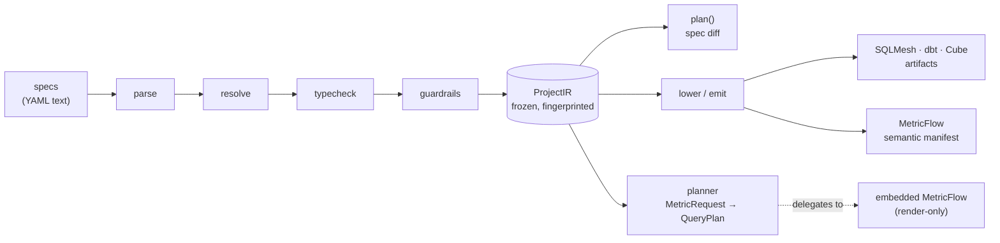

# The compile pipeline

This page explains how specs become artifacts: six pure stages, each of which either
produces trusted output for the next or refuses with a typed error, meeting at a frozen
intermediate representation (IR) that every consumer reads. Emitters and the planner
consume the IR, never the specs — which is why the thing that builds a table and the
thing that queries it can never disagree about what the table means.

Every stage is a pure function: data structures in, data structures out, no I/O, no
clock, no randomness. A stage never patches over bad input from the one before it —
each either succeeds completely or raises a `BloomeryError` subclass carrying a source
path into the offending spec node.

## The six stages

### 1. Parse

YAML text becomes strict, frozen Pydantic models — the five spec kinds plus the
`Project` container. Parse validates *shape*, not references: unknown keys, missing
required fields, bad type grammar, and duplicate YAML keys are all refused, because a
typo'd key that is silently ignored is the worst failure mode in a config-driven
system. Failures are batched per document and raised as one `SpecParseError` listing
every path, so authors fix a spec in one round trip.

### 2. Resolve

The parsed specs become one dependency graph: source columns feed entity fields, entity
fields feed canonical fields through `canonical:` links, canonical fields feed metrics,
and metrics feed metrics. Resolve refuses dangling references (a mapping targeting a
nonexistent entity, a `canonical:` link to a field the catalog does not define) and
invalid recorded recipes — the compiler validates the recipe the mapping recorded but
never chooses one itself. All failures are `ResolutionError`s, batched; a cycle
anywhere in the graph raises `CircularDerivation` naming the full cycle path. Resolve
also produces two things no later stage recomputes: the reachable/unreachable metric
report (with the specific missing leaves) and the deterministic topological emission
order, with ties broken lexicographically.

### 3. Typecheck

Every transform chain is walked against a closed, versioned transform whitelist:
`str → parse_ts → timestamp → to_utc → timestamp` passes; a chain whose terminal type
is not assignable to the declared field type does not. Decimal precision is tracked —
widening is implicit, narrowing must be explicit. An unknown transform name raises
`UnknownTransformError` naming the closest match; a bad chain raises `TypeCheckError`.

### 4. Guardrails

The stage that refuses arithmetic which parses, typechecks, and produces a wrong
number: unit and tax-basis coherence, currency mixing, grain fan-out (including
mart-level `GrainViolation` at the declaration site), and additivity policy. It also
refuses data-quality declarations that cannot mean anything — dedupe without a
tie-break, a quarantine disposition without retention, a redaction that destroys a
mapped path. Violations across the whole project are collected and raised as a single
`GuardrailError` aggregate. These are always errors, never warnings — the
[guardrails](guardrails.md) page walks each one with its failing spec and exact message.

### 5. Plan

`plan(old_ir, new_ir)` is a pure structural diff of two IRs. Every change is classified
— `ADDITIVE`, `WIDENING`, `RENAME`, `RESTATING`, `BREAKING` — with backfill scope and
downstream impact computed from the dependency edges the IR already carries. The stage
refuses expand/contract violations: dropping or narrowing a field that a live metric
still references raises `ContractViolation` (a `PlanError`); deprecation must come
first.

### 6. Lower and emit

The IR becomes target artifacts. Each `SELECT` is constructed as a SQLGlot AST and
rendered per dialect — SQL is never built by string concatenation or Jinja; Jinja
renders only the envelope (a SQLMesh `MODEL (...)` block, a dbt config header). A
feature the target cannot express raises `UnsupportedByTarget` (an `EmitError`) naming
the entity and feature — nothing silently degrades. Every artifact carries a header
comment stamped with the project fingerprint, so drift between applied artifacts and
specs is detectable downstream.

Lowering is also where declared data quality becomes SQL. An entity carrying rules gains
a dedupe `QUALIFY`, a single-pass `_quality_flags` construction, a two-way split into
the entity and its `<entity>__reject` table, blocking audits for `fail` rules and for
the conservation law, and a replay `MERGE` artifact bloomery emits and never runs — see
[Data quality](data-quality.md).

## The IR: the frozen hand-off

Everything between guardrails and emission is a single value: `ProjectIR`, a frozen
dataclass tree designed so the deterministic thing is the only easy thing to write.

- **All collections are tuples**, explicitly sorted on stable identifiers — never sets,
  never insertion-order dicts. The only unsorted fields are those whose authored order
  is meaningful (keys, transform chains, mart flatten steps).
- **SQL is stored as `SqlExpr`** — canonical, dialect-neutral SQLGlot text. The string
  is the value; dialect-specific rendering happens at emit time from a fresh parse,
  which makes the IR trivially hashable and its equality independent of SQLGlot object
  identity.
- **`project_fingerprint(ir)`** is a `blm1:`-prefixed SHA-256 over a canonical byte
  encoding of the whole tree. It is the cache key for compilation results, the header
  stamp in every artifact, and the spec component of the planner's hydration cache
  key — the [determinism](determinism.md) page covers what it does and does not
  promise.

Unreachable metrics are IR members, not log lines: "you can't get margin because `cogs`
is missing" is a product-facing answer, and it travels with the IR to whatever surface
needs it.

## Four ports

Everything variable around the pure core is a port — a `typing.Protocol` an adapter
satisfies without importing a base class.

| Port | Varies over | Knows nothing about |
|---|---|---|
| `TargetEmitter` | SQLMesh, dbt, Cube, MetricFlow manifest | SQL dialects |
| `DialectPort` | DuckDB, Postgres, Trino rendering and physical types | targets |
| `NamingPolicy` | logical name → physical `(namespace, relation)` | everything else — the only tenant-shaped seam in the package |
| `Planner` | the query-planning backend | the caller's identity, connections, execution |

Target and dialect vary independently — SQLMesh-on-Trino and dbt-on-Trino share every
line of dialect logic — so collapsing them would produce an N×M explosion of
near-duplicate templates. This split is the most load-bearing design decision in the
package.

The planner is the fourth port, deliberately not a `TargetEmitter`: emitters run once
per spec version, the planner answers at request time, thousands of times per second —
different lifecycle, different envelope. Its contract is a pair of frozen types,
`MetricRequest` in and `QueryPlan` out, and that contract is the stability boundary:
behind it sits `MetricFlowPlanner`, which delegates SQL generation to an embedded,
render-only MetricFlow (pinned tightly; it drives internal surfaces with no stability
guarantee, so upgrades are deliberate, canary-tested events). Callers bind to
`MetricRequest`/`QueryPlan` and never see a MetricFlow type — errors are translated
into bloomery's taxonomy at the adapter, which is what makes the backend swappable. The
[wide-marts](wide-marts.md) page explains what the planner refuses and why.

Determinism is what holds all six stages together — the same specs must produce the
same bytes forever — and it gets its own page: [Determinism](determinism.md).
