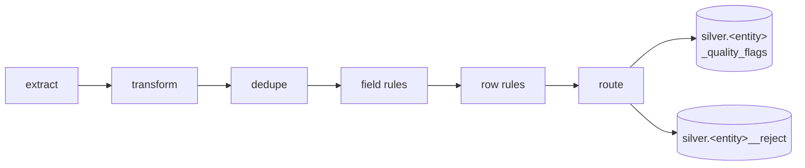

# Data quality

This page explains what happens to a row that is *wrong* — a price that arrives as
`"12,50 €"`, the same order delivered three times, an order line pointing at an order
nobody ingested. Everything else in bloomery is structural: it decides what a table
means. Data quality decides what a **row** does when the data disagrees with the model,
and it decides it in the spec, where `plan()` can see it.

The governing rule is that no row is ever silently discarded. Every rule you declare
carries an explicit disposition, and every row ends up somewhere you can count.

## Guardrails say the model is wrong; quality rules say the data is wrong

These two are easy to confuse and expensive to conflate — a spec where nobody knows
what fails when is worse than either check alone. The boundary is normative:

| | Guardrails | Quality rules |
|---|---|---|
| When | compile time | run time |
| Input | the spec | the data |
| Failure | a `BloomeryError`; nothing is emitted | a disposition per row |
| Example | "summing an order-grain measure on an item-grain mart" | "this row's discount exceeds its gross" |

Anything decidable from the spec alone is a [guardrail](guardrails.md) and refuses at
compile time. Quality rules are the other half: they compile into SQL that runs in your
warehouse and decides, row by row.

## What a declaration looks like

Rules attach in two places: to a mapping field, beside the transform chain that produces
the value, and to an entity, where a rule can read more than one column.

```yaml
fields:                                # on the mapping, beside the transform
  unit_price:
    from: "$.Price"
    transform: [{to_decimal: [12, 4]}]
    quality:
      - {rule: range, min: 0, on_fail: quarantine}
      - {rule: range, max: 1000000, on_fail: flag}

entities:                              # on the entity, for row-wide rules
  order_item:
    grain: one row per line on an order
    key: [order_id, line_no]
    dedupe: {keep: latest_by, field: _ingested_at, tie_break: [_load_id]}
    quarantine: {retention: 90d}
    quality:
      - {rule: expression, name: discount_not_exceeding_gross,
         expr: "discount <= unit_price * quantity", on_fail: flag}
      - {rule: referential, via: item_of_order, on_missing: unknown_member}
```

Everything a rule can say is in that shape: which rule, its parameters, and what happens
to a row that fails. The [add quality rules](../how-to/add-quality-rules.md) guide walks
the whole surface; the rest of this page is why it is shaped that way.

## The three dispositions

`on_fail` is required on every rule. There is no project-wide default, because a
default is the one setting nobody reads before shipping.

| Disposition | What happens to the row |
|---|---|
| `flag` | The row passes through unchanged, with the rule's name appended to `_quality_flags` |
| `quarantine` | The row is diverted to the entity's `<entity>__reject` table, where it stays replayable |
| `fail` | The run stops — the rule compiles to a blocking audit over the rows the pipeline evaluated and the rows already in the entity |

Severity settles what happens when several rules fire on one row: `fail` beats
`quarantine` beats `flag`. A `fail` rule's audit therefore reads the **pre-route**
population, not just the finished model — otherwise a row that failed a blocking rule
*and* a quarantine rule would sit in the reject table with the run carrying on, and the
weaker disposition would quietly win. It reads the finished model too, because a replayed
row enters the entity from the reject table long after its bronze source has aged out of
the incremental window, and an audit blind to that population would report nothing while
the row's own `_quality_flags` named the rule. Whichever way the row went, every rule it
failed is recorded: in `failed_rules` if it was diverted, in `_quality_flags` if it was
kept.

Two absences are deliberate.

**There is no `drop`.** Silently discarding rows is the fastest way for an analytics
product to lose trust permanently, and it is the disposition everyone reaches for first.
`quarantine` is `drop` plus recoverability — which matters because most quarantined rows
come back after a spec fix. Widening an enum is the normal path, not the exception.
Wanting rows genuinely gone means quarantine plus a retention policy: a deletion with a
paper trail.

**There is no `repair` in v1.** Rewriting values needs a recipe contract that does not
exist yet, and a repaired row needs a marker distinct from a flagged one so
"has quality flags" keeps meaning "currently suspect" rather than "was once touched".

When one row fails several rules with different dispositions, severity decides:
`fail` > `quarantine` > `flag`. A row diverted to the reject table records **all** its
failed rule names, its flag-level failures included — the reject row is the full story,
not just the reason it was diverted.

## Coercion failure is a rule

The most common data defect is not a business-rule violation, it is a value that will
not cast. So a transform chain on a quality-carrying entity does not raise on a bad
value: it produces a coercion-failure marker, and the implicit `coercible` rule disposes
of it at `quarantine` by default. One mechanism, one reject table, one vocabulary —
unmapped enum values, failed casts, and rules you wrote all travel the same road.

`coercible` is **opt-in per entity**. An entity joins the quality system by declaring
`quality:`, `quarantine:`, or any field-level `quality:`; `dedupe:` alone does not. An
entity that declares none of them keeps the produce-or-raise lowering it always had.

The marker needs a NULL-on-failure cast, and the three shipped dialects all have one.
DuckDB and Trino spell it `TRY_CAST`. Postgres has no such keyword and gets a guard
around its *own* input parser instead — `CASE WHEN pg_input_is_valid(x, 't') THEN CAST(x
AS t) END` — so the accept/reject set is the engine's rather than a regex approximation
of it. Compiling the dirty-data corpus for Postgres emits the same 70 artifacts as
DuckDB, with the guarded cast in exactly the 66 where DuckDB writes `TRY_CAST`.

One deliberate narrowing comes with the Postgres form. That engine accepts `now`,
`today`, `tomorrow` and `yesterday` as datetime input and resolves them to the
transaction timestamp, so the same cell would coerce to a different value on every run.
Those are excluded from the guard, which makes such a cell an ordinary coercion failure —
quarantined like any other bad value rather than silently unstable.

A dialect *without* a NULL-on-failure cast still cannot host a quality-carrying entity,
or even a dedupe-only one: the ingestion-metadata audit every `dedupe:`/`quarantine:`
entity gets asserts that `_ingested_at` casts to timestamp, and that assertion is itself
a `TRY_CAST`. Compiling either for such a dialect raises `UnsupportedByTarget` rather
than degrading a "quarantine this row" into an "abort this run". No shipped dialect is in
that position; the refusal is what a fourth one would meet if it arrived without the
capability.

## The pipeline order is fixed

Declared once, never per field, never configurable:



The order that matters most is **dedupe before the rules**. The alternative — validate
first, deduplicate the survivors — means a corrupt latest row is silently replaced by a
stale-but-clean older one. That is data loss disguised as data quality: the dashboard
shows an old value with no indication that it is old.

One consequence follows directly. The columns dedupe orders by decide *which* row
survives, so a value that will not cast there leaves the winner undefined. `coercible`
is therefore forced to `fail` on any field named by `dedupe.field` or `tie_break`, and
declaring something weaker on such a field is the compile error
`DedupeDispositionConflict`.

That forcing reaches mapped fields only, and the usual `dedupe.field` is `_ingested_at`
— ingestion metadata, never mapped, so no rule is generated for it. A generated
blocking audit on the ingestion-metadata columns covers it instead. The audit stops the
run on any of three conditions: a null `_load_id`, `_ingested_at`, or `_source_row_id`;
a `_source_row_id` that repeats; or an `_ingested_at` that is present but does not cast
to timestamp. All three are properties of the *data*, so no compiler can check them —
which is why they are asserted at run time rather than refused at compile time.

Dedupe's order is total by construction: the recency field descending, then each
tie-break column, then the stable `_source_row_id` — with `NULLS LAST` pinned on every
sort key. No two rows can compare equal, so the winner is a function of the data rather
than of the engine's mood. That is also why `tie_break` is mandatory under
`keep: latest_by`: without it, two rows sharing a timestamp make the winner arbitrary,
and a nondeterministic model breaks the invariant everything else here rests on.

## A rule fires only when it is definitively true

Every rule defines a *violation predicate* and fires only when that predicate evaluates
to SQL `TRUE`. A NULL-involved comparison evaluates to `UNKNOWN`, and `UNKNOWN` never
fires. This holds for `range`, `length`, `pattern`, `in_enum`, `in_set`, `expression`,
and `referential` alike — **a NULL foreign key is not an orphan**.

Nulls belong to exactly two rules: `not_null` and `coercible`. If a null is invalid in
your model, declare one of them; do not expect a range check to catch it. The
alternative — letting every rule fire on nulls — would make a single missing value light
up half the catalogue, and the reject row would tell you nothing about what actually
went wrong.

The same discipline shapes the `referential` lowering. An orphan is a *non-null* foreign
key with no matching row, which is why the rule lowers to
`CASE WHEN ref.<pk> IS NULL AND fk IS NOT NULL THEN '__unknown__' ELSE fk END` rather
than a bare `COALESCE`. Routing a NULL fk to the reserved member would silently invent a
relationship the source never claimed.

`referential` carries `on_missing` — `unknown_member`, `quarantine`, or `flag` — rather
than `on_fail`, and `fail` is deliberately unavailable. Orphans are an expected,
recoverable condition; a pipeline that stops on every one of them punishes the normal
case. When you genuinely want a pipeline-stopping orphan gate, write it as a `reconcile`
check.

`unknown_member` is the disposition that keeps aggregates *correct*. Dropping orphan
rows makes revenue quietly lower than the source system's; routing them to a reserved
`Unknown` member keeps the total right and makes the problem visible in the dashboard,
which is where someone will actually notice it.

## `pattern` speaks a smaller regex than you do

A `pattern` rule runs on the engine, and the engines disagree: DuckDB and Trino run RE2,
Postgres runs POSIX ARE. So `pattern` accepts a **portable subset** defined by what it
names — literals, `.`, character classes, `\d`/`\w`/`\s` and their negations, the anchors
`^` and `$`, the quantifiers `* + ? {n} {n,} {n,m}`, alternation, and non-capturing
groups `(?:…)`. Everything else is refused at parse, by name, including constructs the
subset simply does not know about. That direction is deliberate: a list of *forbidden*
constructs accepts every construct nobody thought of, and the ones nobody thought of —
backreferences, atomic groups, possessive quantifiers, `\A`/`\Z` — do not degrade
gracefully on RE2. They abort the run.

Two consequences worth knowing before you write one:

- **You write the anchors.** `[0-9]{5}` is refused; `^[0-9]{5}$` is what you meant. Every
  SQL regex predicate matches a *substring*, so unanchored, that rule accepts
  `abc12345xyz`. With alternation, each branch carries its own pair: `^a$|^b$`.
- **Capturing groups are refused** in favour of `(?:…)`. A rule is a boolean match and
  captures nothing, and numbered groups are what backreferences read.

Two divergences are accepted rather than pretended away, both stated here because they
are the ones that could still surprise you: `.` excludes newline on RE2 and includes it
on Postgres, and `\d`/`\w`/`\s` are ASCII on RE2 but locale-defined on Postgres.

## The reject table and the replay lifecycle

One `<entity>__reject` table per entity — never one per mapping, which would multiply
into small files and make replay N-way. It holds the quarantined bronze payload plus
enough identity to be idempotent:

| Column | What it is |
|---|---|
| `reject_id` | SHA-256 over the canonical `(source_relation, _source_row_id)` pair — recomputable from the row itself |
| `source_relation`, `mapping`, `mapping_version` | Where the row came from and which mapping judged it |
| `failed_rules` | Every rule the row failed, flag-level failures included |
| `key_values`, `raw` | The entity key (best-effort) and the bronze payload |
| `_load_id`, `_ingested_at`, `_source_row_id` | The ingestion-metadata contract |
| `first_seen`, `last_seen`, `resolved_at` | The lifecycle — both timestamps are the delivery's `_ingested_at`, never a wall clock |

`_load_id` is deliberately *not* part of the identity. A re-delivery of the same source
row across loads must land on the **same** reject row — that is what `first_seen` and
`last_seen` track. A per-load identity would mint a new reject row per retry and destroy
replay idempotence. The reject model is incremental on `reject_id` and its merge is
selective: a re-delivery advances `last_seen`, `_load_id` and `failed_rules` while
`first_seen` keeps the value it already had. `first_seen` is the column that says when
the problem started, and a merge that overwrote it would leave the pair carrying one
fact under two names.

**Replay** re-runs the current mapping against `raw` for unresolved rows and merges the
passers into the entity by key, using the pipeline's own dedupe order — both against the
incumbent row and against each other, so two reject rows resolving to one key produce one
entity row, not two. The rows that still fail are re-stamped from that same evaluation:
`failed_rules` re-derived, so the reject table's account never ages into a statement about
a spec nobody runs. A candidate that now passes every rule and merely lost its key to a
better one is marked `(superseded)` rather than left with an empty list of reasons.
`last_seen` is not touched: it means "when the source last delivered this row", and since
retention measures unresolved rows from it, a replay run advancing it would keep them
forever. Replay never deletes: a resolved row keeps its reject entry as audit history with
`resolved_at` set, and drops out of the conservation accounting. Retention is the only
deleter.

`retention:` is required the moment any rule can quarantine — not defaulted, because
`raw` holds source payloads and therefore PII, and this is the sort of thing that is
trivial now and a legal problem in eighteen months. `redact:` removes JSONPaths from
`raw` and `key_values` at write time, and the compiler refuses a redaction that
intersects a path the mapping reads: you cannot both require a field and destroy it,
because replay would have nothing left to re-run against.

!!! note "bloomery emits the replay merge; it never runs it"

    Compilation produces a `replay/<entity>.sql` artifact holding the `MERGE` statements
    as one unit of work. Executing them — and executing retention deletes — is the
    caller's job. The package never touches a warehouse.

`plan()` knows about all of this. Adding, removing, or changing a rule, changing a
disposition in either direction, and changing `dedupe` all classify as `RESTATING`, and
a `Plan` carries a `replay_scope` alongside its `backfill_scope`. The distinction is
real: relaxing `quarantine` to `flag` frees rows that are sitting in the reject table,
*not* in bronze's incremental window, so a backfill alone would leave them quarantined
forever.

## The conservation law

Every bronze row lands in exactly one of three places: the entity, an unresolved reject,
or the deduped count. If that holds, rows cannot vanish — and rows vanishing is the
failure mode this whole subsystem exists to make impossible.

It is checked twice. As a property test over generated batches, and as a **blocking
audit emitted on every production run**, one per entity with a reject table. The audit
reads only the bronze source and the model being built, because SQLMesh does not rewrite
model references inside an audit body; that limit means it is skipped for the single
shape it cannot express — `referential` with `on_missing: quarantine`, whose routing
predicate reads a sibling entity. The property test still covers that shape.

The audit is also why mart rowcounts legitimately differ from bronze. Quarantined rows
never reach a mart; the conservation accounting is what makes that difference
explainable rather than alarming.

## Quality is an ordinary mart

Every rule evaluation contributes a row to `gold.mart_data_quality` — `entity`,
`mapping`, `rule`, `disposition`, the four counts (`rows_evaluated`, `rows_failed`,
`rows_quarantined`, `rows_deduped`), and the run context. It is a `MartIR` with measures
and a date role like any other, which is the entire point: quarantine rate is a plain
`MetricRequest`, groupable by entity, filterable, and answerable through the same planner
as revenue.

The counts are stored, the rate is not. `quality_quarantine_rate` is a ratio metric over
two additive measures, so it stays correct at every grouping — a stored rate column
would not be.

"Additive" is a claim about the rows, not just the columns, and the mart is shaped to
make it true. Only `rows_failed` is a fact about a *rule*; the other three describe the
entity's population — how many rows the rules ran over, how many the split diverted, how
many dedupe removed before any rule saw them. So each entity contributes one extra
**accounting row**, marked `(entity)` in the `rule` and `disposition` dimensions, and
rule rows carry zero in those columns. Summing then works at any grouping. The trade is
explicit: `rows_evaluated` cannot be sliced *by rule*, because it was never a per-rule
number — an absent denominator reads as absent, where a repeated one read as a number
and was wrong by the rule count.

A rising quarantine rate is a *semantic* drift signal that structural detection misses
entirely: prices arriving in cents change no schema.

Two honest limits. Reject tables themselves are never exposed through `MetricRequest` —
raw payloads with different retention are a deliberately narrow operator surface, not a
metric. And `run_id` is emitted **declared but NULL** on the pinned SQLMesh, which
exposes no run-identifier macro; the column exists and carries a comment naming what you
have to supply, rather than a macro name that would fail to expand. `run_date` comes
from `@execution_ds`.

## What flags look like downstream

Silver models gain two columns: `_quality_flags` (never NULL — a clean row carries the
empty collection) and the generated `_quality_ok`. A mart whose **base** entity carries
rules flattens the pair into `has_quality_flags`, an ordinary boolean dimension, so
"revenue excluding flagged rows" is a filter on a `MetricRequest` rather than a bespoke
query. Only the base contributes it: a mart is a fact table at its base grain, so "was
this row suspect" is a statement about the base row, and a base with no rules gets no
column rather than a constant `FALSE` one that would read as "nothing is flagged".

The physical shape adapts to the engine: an array where the dialect has one, otherwise a
comma-delimited string joined in lexicographic rule-name order. Rule names are
identifier-constrained at parse time (`[a-z0-9_]+`), so neither form ever needs escaping
and the two agree observably.

Rules judge and route; they do not repair. The thing a `quality:` block cannot do is
*mend* a value — turn `"12,50 €"` into `12.50` — because that is `repair`, and `repair`
is deliberately absent from v1 (above). The one exception is stated rather than hidden:
`referential`'s `on_missing: unknown_member` rewrites an orphan foreign key to the
reserved `'__unknown__'` member, which is the entire point of that disposition and is
visible in the emitted
`CASE WHEN ref.<pk> IS NULL AND fk IS NOT NULL THEN '__unknown__' ELSE fk END`. It
substitutes one reserved value under one stated condition; it does not compute a new
one. That is the same principle that keeps `assert:` clauses
([guardrails](guardrails.md#range-sanity)) as alerts rather than routers. An `assert:`
says "tell me"; a `quality:` rule says "act on the row". A field may carry both. When you
are ready to declare some, the
[add quality rules](../how-to/add-quality-rules.md) guide walks the whole surface, and
[Evolve a spec safely](../how-to/evolve-a-spec.md) covers the `replay_scope` a
disposition change produces.
