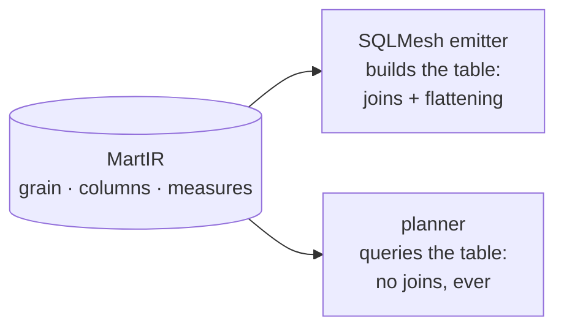

# The wide-mart gold layer

This page explains the doctrine behind bloomery's serving layer: gold is one wide,
pre-joined mart per (grain × subject area), with every dimension flattened in at build
time, so the common query path contains no joins at all. It is a constraint on the
physical layer, chosen deliberately — and it is what turns the classic semantic-layer
failure modes from runtime hazards into compile-time errors.

## Why no query-time joins

Every classic semantic-layer failure is, at root, a query-time-join problem. Because
bloomery's operator controls the physical layer, the join is moved to build time, where
the compiler can verify it once against declared relationship cardinalities instead of
re-planning it per query:

| Classic semantic-layer problem | Under wide marts |
|---|---|
| Fan-out on many-to-one joins | **Structurally impossible** — no join at query time |
| Role-playing dimensions | Flattened to distinct columns at build time |
| Symmetric aggregates | Not needed |
| Multi-fact root selection | Separate marts; cross-mart requests are refused, not guessed |
| Pre-aggregation / caching tier | The mart *is* the pre-aggregation |
| Planner complexity | `SELECT dims, AGG(measures) FROM mart WHERE … GROUP BY dims` |

## Declaring a mart

Marts are the fifth spec kind. Each mart names a base entity, flattens related entities
in through declared relationships, and expands date roles:

```yaml
marts_version: 1
marts:
  order_items:
    grain: order_item            # must equal the base entity's grain
    base: order_item
    flatten:
      - {via: item_of_order,     prefix: order_}
      - {via: order_of_customer, prefix: customer_}
      - {date: order_date, role: ordered}    # → ordered_day … ordered_year
      - {date: ship_date,  role: shipped}
    measures: [gross_revenue, discount, net_revenue, quantity]
    partition_by: [days(ordered_day)]
    cost_hint: 3                 # relative scan cost; tie-breaking only
```

The compiler validates every line of this at compile time: a measure whose grain
differs from the mart's grain is a `GrainViolation`; a `flatten` step through anything
other than a `many_to_one` or `one_to_one` relationship is `FanoutRisk`; post-prefix
column collisions are errors, never auto-renames; and a mart that carries measures must
declare at least one date role (`MartMissingTimeDimension`). Fan-out is refused where
it would be *built*, not detected where it would be *summed* — the
[guardrails](guardrails.md) page shows the exact messages.

## Role-playing dimensions

An order has an order date and a ship date — the same date dimension playing two roles.
This is the concept that breaks naive semantic layers (joining one dimension table
twice under different foreign keys). Bloomery models it once, as a dimension reference
carrying an optional role, and lowers it per consumer. In the mart, each `date:` role
expands at build time into bucket columns — `ordered_day`, `ordered_week`,
`ordered_month`, `ordered_quarter`, `ordered_year`, and likewise `shipped_*` — so
grouping revenue by `ordered_month` and by `shipped_month` reads two different physical
columns and gives two different, correct answers, with no join and no aliasing anywhere
near the query.

An unqualified reference to a dimension with multiple roles is refused with the roles
named:

```
AmbiguousDimension: 'date' has roles [ordered, shipped]. Use 'ordered_date' or 'shipped_date'.
```

## One definition, two consumers

A mart definition is compiled once into the IR and read by two consumers that must
never disagree:



The SQLMesh emitter lowers the mart into the gold-layer model that *builds* the wide
table — the base entity joined once per flatten step and once per date role. That model
is the only place joins are ever emitted for a mart. The planner then treats the built
table as a joinless catalog to select from. Because both read the same IR object, the
thing that builds the table and the thing that queries it cannot disagree about its
grain or its columns.

## Marts are what the semantic manifest is made of

The MetricFlow manifest emitter maps **one mart to exactly one semantic model**: the
mart's grain entity becomes the primary entity, its flattened columns become
dimensions (each date role a time dimension), its measures carry their aggregation and
time dimension, and the catalog's date dimension becomes the declared time spine —
pointing at the same `gold.dim_date` relation the SQLMesh emitter builds. The emitter
never produces a semantic model for a non-materialized entity, because that would
reintroduce the query-time joins this whole design exists to prevent.

## Cross-grain requests are refused, not guessed

A request whose metrics live on different grains has no correct single answer — summing
across grains double-counts. The planner refuses it with the conflict named:

```
UnreachableAtGrain: metrics {shipping_cost, line_discount} live on different grains
  shipping_cost   → grain: order      (mart: gold.mart_orders)
  line_discount   → grain: order_item (mart: gold.mart_order_items)
  Summing across grains would double-count. Request them separately,
  or define a mart at the shared grain.
```

The embedded MetricFlow engine would happily plan a multi-hop join across semantic
models — so bloomery runs a **coverage precheck** before MetricFlow sees the request:
all requested measures must live on one mart, all requested dimensions must be
flattened onto it, and among multiple covering marts the cheapest `cost_hint` wins with
ties broken lexicographically. Refuse-don't-guess is thereby enforced twice — once by
the precheck, once by MetricFlow's own resolver behind it. Belt and braces is correct
here: the product rule is that *the system may not know the answer, but may not return
a wrong one without warning*.

The no-join property is a feature, not a gap. The planner's capability declaration
marks query-time joins as disabled **by policy** — MetricFlow could do them; bloomery
refuses them — so nobody "fixes" it later.

Marts sit at the end of the pipeline described in
[The compile pipeline](compile-pipeline.md); the additivity classes their measures
carry are explained in [Specs and the catalog](specs-and-catalog.md).
